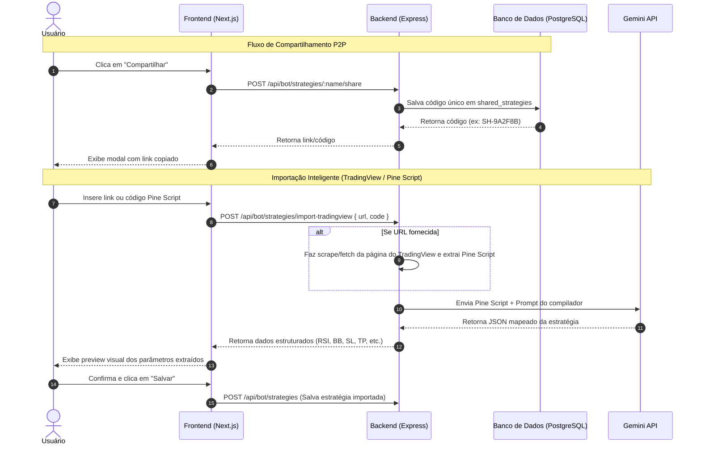

# Plano de Implementação: Compartilhamento e Importador Inteligente de Estratégias

Este documento detalha o plano de arquitetura e implementação para permitir:
1. **Compartilhamento de Estratégias**: Geração de códigos e links de compartilhamento entre usuários.
2. **Importador TradingView / Pine Script**: Extração automatizada e mapeamento de lógica e parâmetros de indicadores de scripts do TradingView utilizando a IA (Gemini API) integrada no sistema.

---

## 1. Arquitetura do Sistema

O fluxo de funcionamento do importador e compartilhamento seguirá a estrutura abaixo:



---

## 2. Modelagem do Banco de Dados

### Tabela `shared_strategies`
Tabela para rastrear estratégias publicadas para importação. Isso evita vazamento de dados confidenciais de usuários, expondo apenas o modelo de configuração da estratégia.

```sql
CREATE TABLE IF NOT EXISTS shared_strategies (
  code         VARCHAR(20) PRIMARY KEY, -- ex: SH-ABCD12
  owner_id     UUID NOT NULL REFERENCES users(id) ON DELETE CASCADE,
  name         VARCHAR(100) NOT NULL,
  description  TEXT,
  strategy     VARCHAR(50) NOT NULL,
  mode         VARCHAR(20) NOT NULL,
  symbols      TEXT[] NOT NULL,
  timeframes   TEXT[] NOT NULL,
  filters      JSONB NOT NULL DEFAULT '{}'::jsonb,
  sl           JSONB NOT NULL DEFAULT '{}'::jsonb,
  tp           JSONB NOT NULL DEFAULT '{}'::jsonb,
  created_at   TIMESTAMPTZ DEFAULT NOW()
);

CREATE INDEX IF NOT EXISTS idx_shared_strategies_code ON shared_strategies(code);
```

---

## 3. Endpoints da API (Backend - `server.js` & `db.js`)

### Compartilhamento
1. **`POST /api/bot/strategies/:name/share`**
   * **Objetivo**: Tornar uma estratégia existente compartilhável.
   * **Lógica**: Gera um código randômico curto (ex: `SH-` + 6 caracteres hexadecimais), copia os dados da estratégia correspondente do usuário e os salva na tabela `shared_strategies`.
2. **`GET /api/bot/strategies/shared/:code`**
   * **Objetivo**: Recuperar as configurações de uma estratégia compartilhada para visualização antes de importar.

### Importador por IA (TradingView / Pine Script)
3. **`POST /api/bot/strategies/import-tradingview`**
   * **Objetivo**: Extrair a lógica do Pine Script e converter nos parâmetros da plataforma.
   * **Parâmetros**: `{ url: string, rawPineScript?: string }`
   * **Lógica do Handler**:
     * Se houver `url`, o backend efetua uma requisição `fetch(url)`. Utiliza seletores HTML específicos (como buscar o bloco de dados init ou a tag de código) para extrair o código Pine Script público.
     * Caso o TradingView bloqueie o scrape (Cloudflare), o usuário tem a alternativa direta de colar o código Pine Script no input do frontend.
     * Envia o Pine Script ao modelo Gemini (`gemini-2.5-flash` ou similar disponível no sistema) com um prompt estruturado.

#### Prompt System para o Gemini (Compilador de Estratégias):
```text
Você é um compilador de estratégias de trading automatizadas.
Analise o script em Pine Script (TradingView) fornecido e extraia:
1. Indicadores utilizados (ex: RSI, Bandas de Bollinger, Médias Móveis, MACD, etc.).
2. Parâmetros numéricos associados (ex: período do RSI, desvio padrão das BBs, comprimento das EMAs).
3. Condições e gatilhos de Entrada (compra/venda).
4. Valores de Stop Loss (SL) e Take Profit (TP), mapeando-os como porcentagem decimal.

Retorne APENAS um objeto JSON válido, sem markdown ou explicações externas, no seguinte formato:
{
  "name": "Nome sugerido",
  "description": "Breve descrição do comportamento do script",
  "strategy": "rsi-bb" ou "moving-average" ou "custom",
  "filters": {
     // Ex: "rsi": {"period": 14, "overbought": 70, "oversold": 30}
  },
  "sl": { "type": "percentage", "value": 1.5 },
  "tp": { "type": "percentage", "value": 3.0 }
}
```

---

## 4. Interface do Usuário (Frontend - Next.js)

### Modificações na Página `estrategias/page.tsx`
* **Botão de Importação**: Inserção de um botão com ícone de `Download` ao lado de "Nova Estratégia".
* **Ação nos Cards de Estratégia**: Adicionar um ícone de `Share2` discreto em cada card. Ao clicar, exibe um modal flutuante de compartilhamento.

#### Mockup do Modal de Compartilhamento
```typescript
<Modal title="Compartilhar Estratégia">
  <div className="space-y-4">
    <p className="text-xs text-muted">
      Qualquer pessoa com o código ou link abaixo poderá importar uma cópia desta estratégia.
    </p>
    <div className="flex gap-2 items-center bg-[var(--color-surface-3)] p-3 rounded-lg border border-[var(--color-border)]">
      <span className="font-mono text-sm text-[var(--color-brand-500)]">SH-9A2F8B</span>
      <Button size="sm" className="ml-auto" onClick={handleCopy}>Copiar Código</Button>
    </div>
  </div>
</Modal>
```

#### Mockup do Modal de Importação
```typescript
<Modal title="Importar Estratégia">
  <Tabs>
    <Tab label="Código P2P">
      <Input placeholder="Cole o código (ex: SH-9A2F8B)" />
      <Button>Buscar e Importar</Button>
    </Tab>
    <Tab label="TradingView ou Pine Script">
      <Input placeholder="Cole a URL do TradingView ou Script Público" />
      <span className="text-[10px] text-muted">Ou cole o código Pine Script diretamente:</span>
      <Textarea placeholder="// Pine Script original..." />
      <Button>Analisar com IA ⚡</Button>
    </Tab>
  </Tabs>
</Modal>
```

### Visualização do Preview da IA (Review & Confirm)
Ao terminar a análise do script pelo Gemini, a interface apresentará um sumário interativo antes de salvar:
* **Nome & Descrição** detectados (editáveis pelo usuário).
* **Parâmetros Mapeados**: Exibe os indicadores identificados em pequenos cards (ex: `RSI: Período 14 | Compra < 30`).
* **Gatilhos de Proteção**: Inputs preenchidos com os valores de Take Profit e Stop Loss sugeridos.
* Ao clicar em "Salvar e Criar", a estratégia entra para a lista do usuário.

---

## 5. Cronograma e Etapas de Desenvolvimento

1. **Fase 1: Banco de Dados**: Criar a migration e as funções em `db.js` para manipulação de estratégias compartilhadas (`listShared`, `createShared`).
2. **Fase 2: APIs de Compartilhamento**: Desenvolver os endpoints de share e get shared strategy.
3. **Fase 3: Crawler & Gemini Integration**: Desenvolver o crawler HTML do TradingView e o parser utilizando o SDK do Gemini no Express.
4. **Fase 4: Frontend UI**: Construir os modais de Compartilhamento, Importação e a tela de Preview/Revisão dos parâmetros extraídos.
5. **Fase 5: Testes**: Validar o fluxo completo usando URLs reais de scripts públicos do TradingView.
